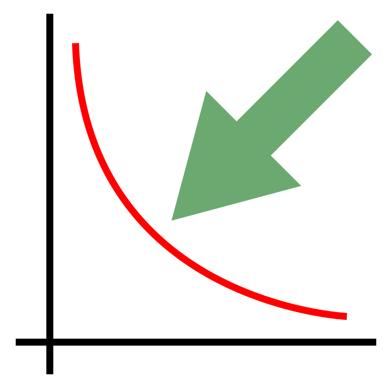

# Response Surface Pareto Front Generator

Tool for creating a tradeoff curve (Pareto front) for two competing design requirements by fitting a response surface to design of experiments data (DOE). 

This tool runs in your browser and is available [here](https://mgreminger.github.io/response-surface-pareto/). Pareto front caculations are performed using Python in the browser with [Pyodide](https://github.com/iodide-project/pyodide). The [trust-constr](https://github.com/mgreminger/trust-constr) algorithm that has been extracted from the [SciPy](https://www.scipy.org/) library is used to performed the constrained optimization runs required to generated the pareto front. [Svelte](https://svelte.dev/) is used to implement the user interface, [plotly](https://plotly.com/javascript/) is used for plotting, and [sheetjs](https://github.com/SheetJS/sheetjs) is used for spreadsheet file I/O. 
